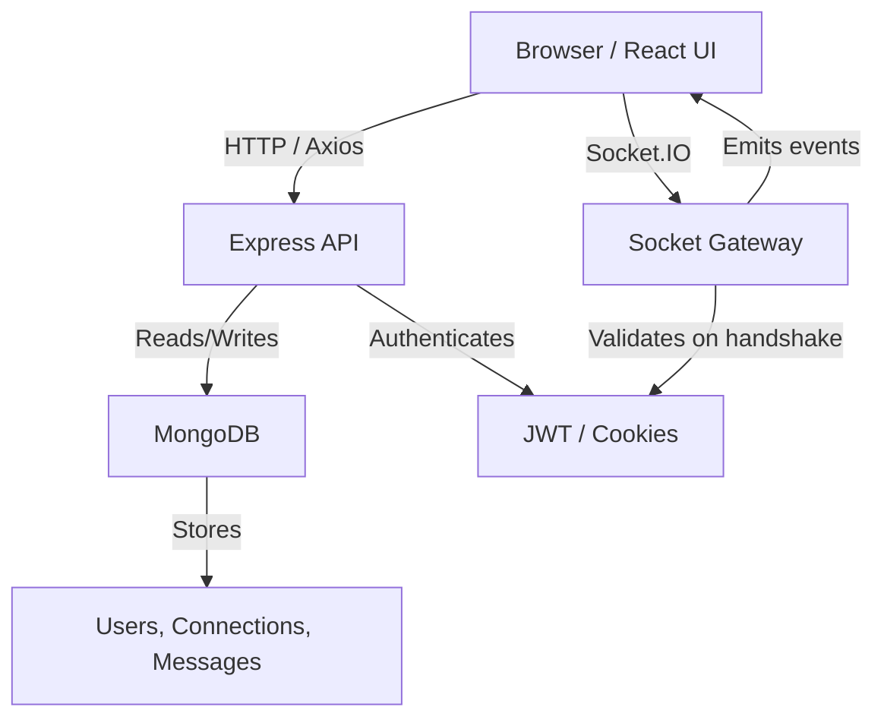

# DevNetwork Project Documentation

## Table of Contents

1. Executive Summary
2. Project Overview
3. Problem Statement
4. High-Level Architecture
5. System Design
6. Complete Folder Structure Analysis
7. Frontend Deep Dive
8. Backend Deep Dive
9. Database Deep Dive
10. Authentication and Security
11. API Documentation
12. Real-Time Communication (Socket.io)
13. State Management
14. Feature-by-Feature Breakdown
15. AI/ML Module Analysis
16. Third-Party Libraries Deep Dive
17. Complete Project Workflow
18. Production Deployment
19. Performance Optimization
20. Future Scope
21. Interview Preparation Section
22. Project Defense Guide
23. Key Learning Outcomes

---

## 1. Executive Summary

DevNetwork is a modern social networking application for developers and professionals. It supports user registration, profile creation, relationship building through connection requests, real-time chat, and discovery of new developer profiles.

This project was built to demonstrate a full-stack web application with a React frontend and a Node.js backend. It solves the problem of connecting developers across locations, enabling them to form professional relationships, exchange messages, and build a community.

Target users:

- Recruiters looking to discover developer talent.
- Interviewers evaluating system design and engineering skills.
- College project evaluators reviewing frontend/backend integration.
- Junior developers learning how to build a real-world app.
- Developers unfamiliar with the project seeking step-by-step onboarding.
- Future contributors who need a reference to extend the platform.

Real-world applications:

- A lite LinkedIn-like network for developers.
- A community platform for hackathons and developer meetups.
- A networking layer for bootcamps and student groups.
- A portfolio site where developers can showcase skills and connect.

Business value:

- Increases engagement by enabling connections and chat.
- Supports personalized discovery with a feed of developer profiles.
- Enables future monetization via premium networking features.
- Demonstrates secure authentication, real-time messaging, and scalable data patterns.

---

## 2. Project Overview

### Objective

The objective is to deliver a developer networking platform with the following capabilities:

- User onboarding through sign-up and login.
- Profile management and editing.
- Developer discovery feed with connection actions.
- Connection request review and acceptance workflow.
- Real-time private chat between connected users.

### Scope

The project delivers two separate parts:

- `DevNetwork Frontend`: React-based UI with routing, state management, notifications, and socket support.
- `DevNetwork`: Node.js backend with Express, authentication, REST API, WebSocket support, and MongoDB persistence.

### Features

- Registration and login using email and password.
- JWT stored in HTTP-only cookies for secure authentication.
- Profile viewing and editing.
- Developer discovery feed with swipe-style connect/ignore interactions.
- Connection request management: receive, accept, reject.
- Connection list display.
- Private real-time chat for connected users.
- Toast notifications for user events.

### Functional Requirements

- Users must create accounts with valid email and password.
- Users must log in to access protected routes.
- The backend must validate inputs and protect sensitive fields.
- Users can send connection requests to other developers.
- Users can accept or reject incoming requests.
- Users can chat only when a mutual connection exists.
- The frontend must maintain app state with Redux.

### Non-functional Requirements

- Secure authentication using JWT and cookies.
- Responsive UI suitable for desktop and mobile.
- Cross-origin support for frontend and backend separation.
- Real-time updates via Socket.IO.
- Clear error handling and notifications.
- Easy local development with Vite and nodemon.

Example: a developer signs up, edits their profile, browses the feed, sends a connection request, accepts a request, and then opens a chat with the accepted contact.

---

## 3. Problem Statement

### Existing Challenges

Networking applications must handle identity, relationships, and instant communication safely. Traditional systems can suffer from:

- Poor onboarding flow.
- Unclear request/connection management.
- Security problems from bad cookie handling.
- Delays from polling instead of real-time messaging.

### Limitations of Traditional Approaches

Older apps often use server sessions instead of stateless JWT tokens, making scaling harder. Without proper sanitization, they are vulnerable to injection attacks and insecure password storage. Polling-based chat is inefficient and slow.

### Why This Project is Needed

DevNetwork provides a small but complete example of a modern developer network. It combines profile discovery, connection management, and live chat with a clean separation of frontend and backend responsibilities.

Real-world scenario:

- A developer wants to find peers with similar skills and location.
- They should be able to send a request and receive a notification instantly.
- Once connected, they need a private chat channel without refreshing the page.

---

## 4. High-Level Architecture

### Part 1: Frontend

The frontend is responsible for user experience, client-side state, and event presentation. It is structured as a component-driven React application with the following conceptual layers:

- Presentation layer: page components such as `Feed`, `Requests`, `Connections`, `Chat`, and `Profile`.
- State layer: global and local state with Redux Toolkit and component state hooks.
- Data access layer: API calls via `axios` and real-time socket events.
- Routing layer: route matching and nested layouts with `react-router`.

Frontend responsibilities:

- render the application UI based on authenticated state and fetched data.
- manage navigation and authorization gateways.
- keep a single long-lived Socket.IO connection for notifications and chat.
- provide controlled form handling for login, signup, and profile editing.

### Part 2: Backend

The backend implements the business logic, persistence, and communication contracts.
It can be thought of as a service layer with the following domains:

- Authentication domain: sign-up, login, logout, JWT handling.
- User domain: profile storage, validation, updates.
- Relationship domain: connection request workflow, status transitions.
- Chat domain: message persistence, private room delivery, message statuses.

Backend architecture:

- API layer: Express routers for domain-specific routes.
- Middleware layer: authentication (`userAuth`), CORS, JSON body parsing, cookie parsing.
- Persistence layer: Mongoose models and MongoDB documents.
- Real-time layer: Socket.IO event handlers and authenticated sockets.

### Layered Architecture Diagram

```text
Frontend (React)         Backend (Express + Socket.IO)      Database (MongoDB)
-----------------        -----------------------------      -----------------
Browser UI              HTTP Routers / Socket Gateway        Users Collection
Routes + Pages          Auth Middleware                     ConnectionRequests
State Store             Business Logic                      ChatMessages
Socket Context          Notification Events                 Indexes & Relations
```

### Architecture Diagrams

#### Mermaid-style Architecture Flow



#### ASCII Sequence Diagram

```text
User Browser --> [React App]: render UI, route to /feed
React App --> [Axios REST API]: GET /feed
[Axios REST API] --> [Auth Middleware]: validate JWT cookie
[Auth Middleware] --> [MongoDB]: query feed candidates
[MongoDB] --> [Axios REST API]: profile results
[Axios REST API] --> React App: feed data
React App --> [Socket.IO Server]: connect + auth handshake
Socket.IO Server --> React App: 'request:received' / 'chat:message'
React App --> [Socket.IO Server]: emit chat:send
[Socket.IO Server] --> [MongoDB]: persist chat message
```

### Architectural Patterns

- Separation of concerns: UI vs business logic vs data.
- Single source of truth: Redux centralizes authenticated user and feed/request state.
- Stateless HTTP: The REST API is stateless except for the cookie-based JWT session token.
- Stateful socket channel: Socket.IO keeps a persistent connection for real-time events.
- Event-driven notifications: Connection and chat events are emitted only when state changes.

### Database

The backend persists domain state in MongoDB, making the database the authoritative source for:

- `User` profiles and authentication data.
- `ConnectionRequest` states that model social graph edges.
- `ChatMessage` history for private discussions.

### Authentication

Authentication has two parallel implementation paths:

- HTTP path: user actions over REST routes validated by `userAuth` middleware.
- Socket path: each Socket.IO handshake validates the same JWT token.

This dual model ensures both API and socket channels trust the same identity source.

### API Contracts

The contract between frontend and backend is a mixture of REST and event-driven messages:

- REST endpoints are used for persistent state changes and data retrieval.
- Socket events are used for asynchronous notifications and live chat messaging.

### Data Flow Explanation

1. The user signs up or logs in through the frontend UI.
2. The backend validates input with validator rules and Mongoose.
3. For login/signup, the backend hashes passwords, issues a JWT, and sets an HTTP-only cookie.
4. The frontend stores user profile data in Redux and starts the app shell.
5. The app shell establishes a Socket.IO connection and authenticates the socket.
6. The feed loads via `/feed`, which excludes existing relationships in the database.
7. When the user sends a request, the backend persists it and emits a `request:received` event.
8. When a request is accepted or rejected, the backend updates status and emits `request:reviewed`.
9. When connected users enter chat, the server validates room membership and persists messages.

### Request-Response Lifecycle

#### HTTP lifecycle

- Client sends request with cookies.
- CORS middleware validates origin and credentials.
- JSON parser reads payload.
- `userAuth` verifies JWT and attaches `req.user`.
- Route handler performs business logic and data operations.
- Response is serialized and returned to the browser.

#### Socket lifecycle

- Client connects to Socket.IO with credentials.
- Handshake middleware parses cookies and verifies JWT.
- If valid, the socket is joined into user-specific rooms.
- Client emits events such as `joinChat` or `chat:send`.
- Server validates payload and relationship rules.
- Server persists messages and emits events to rooms.

### User Journey

1. The app loads and the shell `Body.jsx` checks for an existing profile.
2. Authenticated users get redirected to `/feed` automatically.
3. `Feed.jsx` displays discoverable developers from a sanitized backend query.
4. The user sends a request; the request is saved and a notification event is emitted.
5. The receiving user sees the request in `/requests`, accepts or rejects it.
6. Accepted connections appear in `/connections`.
7. The user enters `/chat/:userId`; the chat room is joined only if the relationship exists.
8. Messages are exchanged in real time and stored for later retrieval.

---

## 5. System Design

### Overall System Design

The system adopts a modular service architecture where independent domains map to separate code boundaries. This design reduces coupling and improves reasoning about the app.

Key boundaries:

- User domain (profile, auth)
- Relationship domain (connection requests, acceptance)
- Communication domain (real-time chat and notifications)
- Infrastructure domain (database, socket gateway, middleware)

These domains help ensure changes in one area do not ripple unpredictably into others.

### Client-Server Communication

The app uses a hybrid communication model:

- HTTP/REST for deterministic operations and data queries.
- Socket.IO for asynchronous notifications and chat interactions.

This model is beneficial because

- REST is ideal for fetch/update operations and browser refresh resilience.
- Socket.IO is ideal for instant events, presence, and low-latency chat.

### Detailed Data Flow

#### Feed Generation

- Backend queries `ConnectionRequest` for any relationship involving the logged-in user.
- It builds an exclusion set of user IDs to hide already connected or rejected/ignored users.
- It then queries `User` documents excluding that set and the current user.
- The response is returned to the frontend and stored in Redux.

#### Request Workflow

- The frontend sends `POST /request/send/:status/:toUserId`.
- The backend validates the target user and status.
- It checks the request graph for duplicates in either direction.
- It saves a new `ConnectionRequest` document.
- If the status is `interested`, a socket event is emitted to the recipient.

#### Chat Workflow

- The user visits `/chat/:userId`.
- `Chat.jsx` fetches participant info and previous messages.
- It emits `joinChat` on the socket to join a private room.
- When `chat:send` is emitted, the server checks connection validity.
- The server saves a message document and emits `chat:message`.

### API Interactions

- Frontend uses `axios` with `withCredentials: true` so cookie-based auth works across origins.
- Backend enables CORS for `http://localhost:5173` and allows credentials.
- This avoids the common issue where cookies are stripped from cross-origin requests.

### Component Communication Patterns

- `Body.jsx` serves as the root layout and the place where socket state is created.
- The `SocketContext` allows deeply nested children to access the same socket without prop drilling.
- Redux slices separate domain concerns: user profile, feed, requests.
- Components use selectors and dispatchers to read state and update it.

### Frontend vs Backend Roles

- Frontend is responsible for UI state, validation feedback, and event handling.
- Backend is responsible for enforcing security, validation, business invariants, and persistence.
- The frontend assumes the backend is the source of truth for user relationships, chat history, and permissions.

### Error Handling and Fault Boundaries

- Frontend components catch Axios errors and show toast notifications.
- Backend route handlers return proper HTTP status codes.
- Socket callbacks return `{ status: 'ok' }` or `{ status: 'error', message }`.
- This explicit callback pattern makes the real-time path resilient to payload failures.

### Consistency Model

The app favors eventual consistency in real-time notifications:

- A request may arrive through REST and socket in near-simultaneity.
- The frontend state is updated from the socket event and REST fetch.
- The backend database remains authoritative.

### Security and Trust Model

- Session trust is derived from JWT signature verification.
- The same JWT secret is used in HTTP and socket handshake.
- This ensures a single trust boundary for identity across transport channels.

### Scaling Considerations

The current architecture is suitable for a single-node deployment. To scale:

- Introduce a Socket.IO adapter such as Redis for multiple backend instances.
- Keep the REST API stateless so any instance can serve requests.
- Use database connection pooling and index support for query speed.

### Major Module Inputs, Processing, Outputs

- `authRouter`:
  - Input: credentials or signup payload.
  - Processing: validation, password hash, duplicate check, JWT issuance.
  - Output: `token` cookie and sanitized user data or success message.

- `profileRouter`:
  - Input: user updates or password changes.
  - Processing: field filtering, password comparison, Mongoose validation.
  - Output: updated profile or status message.

- `requestRouter`:
  - Input: user action to send or review a request.
  - Processing: existence checks, direction-sensitive duplicate guards, status updates.
  - Output: request record and socket notification if needed.

- `chatRouter`:
  - Input: participant ID and chat request.
  - Processing: connection verification and message retrieval.
  - Output: participant info or ordered message list.

---

## 6. Complete Folder Structure Analysis

### `DevNetwork/`

This folder is the backend server.

#### `package.json`

- Lists backend dependencies: `express`, `mongoose`, `jsonwebtoken`, `cookie-parser`, `cors`, `bcrypt`, `socket.io`, `validator`, `dotenv`.
- Scripts: `npm start` uses `nodemon src/app.js`.

#### `src/app.js`

- Main application entry point.
- Configures Express, Socket.IO, middleware, routes, and database connection.
- Implements socket authentication and real-time chat events.

#### `src/config/database.js`

- Establishes MongoDB connection using `mongoose.connect`.
- Uses environment variables for the password.

#### `src/middlewares/auth.js`

- Contains `userAuth` middleware.
- Reads the JWT token from cookies and verifies it.
- Loads the user document and attaches it to `req.user`.

#### `src/models/user.js`

- Defines the `User` schema.
- Includes validation for names, email, password strength, age, gender, URLs.
- Contains instance methods: `getJWT` and `validatePassword`.

#### `src/models/connectionRequest.js`

- Defines connection request schema and status enum.
- Adds a pre-save hook to prevent self-requests.
- Adds a compound unique index for `(fromUserId, toUserId)`.

#### `src/models/chatMessages.js`

- Defines chat message schema for private messages.
- Includes status and message type enums.
- Adds an index for message retrieval by participants.

#### `src/routes/auth.js`

- Signup, login, logout endpoints.
- Uses validation middleware and sanitization.

#### `src/routes/profile.js`

- Profile fetch, profile edit, and password change endpoints.

#### `src/routes/request.js`

- Request sending and review endpoints.
- Sends socket notifications for request events.

#### `src/routes/user.js`

- Fetch user requests, accepted connections, and feed data.
- Performs pagination and exclusion logic.

#### `src/routes/chat.js`

- Fetches chat participants and message histories for connected users.

#### `src/utils/sanitizeData.js`

- Contains response sanitization utilities to remove secret fields.

#### `src/utils/validate.js`

- Contains request validation utilities for signup, login, and profile edit.

#### `apisList.md`

- High-level list of backend endpoints and statuses.

#### `readme.md` and `Project_Details.md`

- Internal notes, setup hints, and architecture reminders.

---

### `DevNetwork Frontend/`

This folder contains the React app.

#### `package.json`

- Frontend dependencies include React 19, Redux Toolkit, Tailwind CSS, React Router, Axios, Socket.IO Client, and React Hot Toast.
- Dev dependencies include Vite, ESLint, DaisyUI, and TypeScript declaration packages.

#### `vite.config.js`

- Configures Vite with React and Tailwind plugins.

#### `eslint.config.js`

- ESLint configuration for JSX, React hooks, and Vite.

#### `src/main.jsx`

- App entry point.
- Wraps `<App />` with Redux `Provider`.

#### `src/App.jsx`

- Contains `BrowserRouter` and route definitions.
- Uses `Routes` and `Route` to mount child pages under `<Body />`.

#### `src/context/SocketContext.jsx`

- React context for sharing a single socket instance.

#### `src/utils/constants.js`

- Stores the backend API base URL.

#### `src/utils/appStore.js`

- Configures Redux Toolkit store with slices.

#### `src/utils/userSlice.js`

- Manages authenticated user data.

#### `src/utils/feedSlice.js`

- Manages feed card data.

#### `src/utils/requestsSlice.js`

- Manages incoming request state and real-time updates.

#### `src/components/Body.jsx`

- Root layout component.
- Fetches authenticated profile data.
- Initializes Socket.IO client and handles socket events.
- Provides `SocketContext` to child components.

#### `src/components/NavBar.jsx`

- Navigation bar with links to feed, requests, connections, profile, and logout.

#### `src/components/Login.jsx`

- Login form with error handling and redirect.

#### `src/components/Signup.jsx`

- Signup form with validation and backend interaction.

#### `src/components/Feed.jsx`

- Displays a discovery feed of developer profiles.
- Loads feed data from `/feed`.

#### `src/components/UserFeedCard.jsx`

- Renders profile cards with connect/skip actions.
- Sends requests to the backend and updates Redux.

#### `src/components/Requests.jsx`

- Shows pending incoming requests.
- Uses `UserDetailsCard` to accept or reject.

#### `src/components/Connections.jsx`

- Displays accepted connections and chat buttons.

#### `src/components/Profile.jsx`

- Shows authenticated user details and edit button.

#### `src/components/EditProfileForm.jsx`

- Modal form that updates profile details.

#### `src/components/Chat.jsx`

- Real-time chat room between connected users.
- Loads chat participant and message history.
- Sends chat events through socket.

#### `src/components/LoadingPage.jsx`

- Reusable loading UI.

#### `src/components/ToastNotification.jsx`

- Custom toast wrapper for notifications.

---

## 7. Frontend Deep Dive

### React

**What it is:** React is a JavaScript library for building UI components.
**Why used:** It allows declarative component composition, reactivity, reusable UI, and efficient updates.
**How it works:** React creates a virtual DOM and re-renders only the changed components.
**Advantages:** fast updates, component reuse, strong ecosystem.
**Alternative:** Vue, Angular, Svelte.

### Vite

**What it is:** Vite is a modern frontend build tool optimized for fast dev server startup and HMR.
**Why used:** Faster than older bundlers because it serves native ES modules during development.
**How it works:** It bundles only for production and uses ESM in development.
**Project usage:** `vite.config.js` configures React and Tailwind plugins.

### Tailwind CSS

**What it is:** Utility-first CSS framework.
**Why used:** Rapid styling with prebuilt classes and consistent design.
**How it works:** Classes compile into CSS utilities.
**Advantages:** low CSS bloat, fast iteration.
**Alternative:** Bootstrap, Chakra UI, plain CSS.

### React Router

**What it is:** Routing library for React.
**Why used:** Enables client-side navigation and nested routes.
**How it works:** `BrowserRouter` listens to URL changes and renders matching components.
**Project usage:** Routes defined in `App.jsx`, with `<Body />` as layout and child pages.

### Context API

**What it is:** React feature to pass data through component tree without extra props.
**Why used:** Provides the `Socket.IO` instance to any child component.
**Project usage:** `SocketContext` exports `useSocket()` to access socket easily.

### Redux Toolkit

**What it is:** Opinionated Redux library for simpler state management.
**Why used:** Centralizes user, feed, and request state across routes.
**How it works:** Stores state slices, reducers, and actions.
**Project usage:** `appStore.js` combines `user`, `feed`, `requests` slices.

### Axios

**What it is:** HTTP client library.
**Why used:** Easier request management, built-in JSON handling, and cross-browser compatibility.
**Project usage:** All API calls use `axios` with `withCredentials: true`.

### Socket.IO Client

**What it is:** Real-time communication library for browsers.
**Why used:** Provides event-based sockets with fallback support.
**Project usage:** `Body.jsx` initializes socket and listens for events.

### React Hot Toast

**What it is:** Lightweight notification library.
**Why used:** Display transient user feedback.
**Project usage:** `ToastNotification.jsx` wraps custom toasts for success/error/info.

### DaisyUI

**What it is:** Tailwind component library.
**Why used:** Provides accessible UI components like dropdowns.
**Project usage:** used in NavBar dropdown.

### Example: `Body.jsx` socket initialization

```js
const socket = io(baseURL, {
  withCredentials: true,
  transports: ["websocket"],
});
```

### Frontend Advanced Concepts

- Route-based layouts using `<Outlet />`.
- Redux slices for independent domain state.
- `useEffect` for side effects like API calls and socket creation.
- Controlled form inputs for login/signup.
- Real-time event handling with socket listeners.

---

## 8. Backend Deep Dive

### Node.js

**What it is:** JavaScript runtime built on Chrome's V8.
**Why used:** Enables JavaScript on the server.
**How it works:** Event-driven, non-blocking I/O.
**Project usage:** Runs Express app and Socket.IO.

### Express.js

**What it is:** Minimal web framework.
**Why used:** Simple routing and middleware support.
**How it works:** Uses a middleware chain to process requests.
**Project usage:** Routing and middleware are configured in `src/app.js`.

### REST APIs

**What it is:** Architectural style for HTTP services.
**Why used:** Standardized CRUD operations.
**How it works:** Uses HTTP verbs to act on resources.
**Project usage:** Endpoints like `/signup`, `/feed`, `/request/send/...`.

### Middleware

**What it is:** Functions that run before request handlers.
**Why used:** Authentication, parsing, CORS, error handling.
**Project usage:** `express.json()`, `cookieParser()`, `cors()`, `userAuth`.

### JWT

**What it is:** JSON Web Token for stateless authentication.
**Why used:** Avoid server sessions and allow token-based auth.
**How it works:** Payload is signed and verified.
**Project usage:** `userSchema.methods.getJWT()` creates tokens.

### Authentication

**What it is:** Verifying identity.
**Why used:** Protect access to private resources.
**How it works:** Cookies store JWT; `userAuth` verifies.

### Authorization

**What it is:** Checking access rights.
**Project usage:** Chat and protected routes verify connections and request ownership.

### Cookies

**What it is:** Browser storage included in HTTP requests.
**Why used:** Persist auth token across requests.
**Project usage:** HTTP-only cookie named `token`.

### Socket.IO

**What it is:** WebSocket library with fallbacks.
**Why used:** Real-time messaging and notifications.
**How it works:** Server and client exchange events, with a handshake.

### Async Programming

**Project usage:** `async/await` in routes and socket handlers.

- `await axios.get(...)`
- `await newUser.save()`

### Error Handling

- Route errors return HTTP codes and messages.
- Duplicate user errors return 409.
- Authentication errors return 401.

---

## 9. Database Deep Dive

### Database Used

MongoDB Atlas is used via `mongoose.connect` in `src/config/database.js`.

### Schema Design

The backend uses Mongoose schemas to enforce document shape, validation rules, and relationships at the application layer before data is persisted.

#### User Collection

The `User` model is defined in `src/models/user.js` and includes:

- `firstName` (String): required, trimmed, 3-25 chars, alphabetic validation via `validator.isAlpha` after whitespace removal.
- `lastName` (String): optional, trimmed, 3-25 chars, alphabetic validation.
- `emailId` (String): required, unique, lowercased, validated as email.
- `password` (String): required, trimmed, validated as a strong password.
- `age` (Number): optional integer between 15 and 50.
- `gender` (String): required, lowercased, restricted to `male`, `female`, or `others`.
- `description` (String): optional, trimmed, max 150 chars.
- `photoUrl` (String): optional URL validated with `validator.isURL`.
- `skills` (Array<String>): normalized strings for user skills.
- `city`, `state`, `college` (String): optional location and education fields with basic string validation.
- timestamps: `createdAt`, `updatedAt`.

The `User` schema also exposes instance methods:

- `getJWT()`: signs a JWT containing the `_id` and expires in 7 days.
- `validatePassword(passwordInputByUser)`: compares a plaintext password against the stored bcrypt hash.

These methods encapsulate authentication logic on the model and keep controllers focused on request flow.

#### ConnectionRequest Collection

The `ConnectionRequest` model in `src/models/connectionRequest.js` represents a relationship edge.
Fields:

- `fromUserId` (ObjectId, ref `User`): sender of the request.
- `toUserId` (ObjectId, ref `User`): recipient of the request.
- `status` (String): enum limited to `interested`, `rejected`, `accepted`, or `ignored`.
- timestamps.

Key model behavior:

- A pre-save hook rejects self-directed requests by comparing `fromUserId` and `toUserId`.
- A compound unique index on `{ fromUserId, toUserId }` prevents duplicate requests in the same direction and reduces race-condition risk.

This model is the source of truth for connection state and allows the app to query pending requests, accepted connections, and ignored/rejected history.

#### ChatMessage Collection

The `ChatMessage` model in `src/models/chatMessages.js` stores private chat events.
Fields:

- `fromUserId` (ObjectId, ref `User`): sender.
- `toUserId` (ObjectId, ref `User`): recipient.
- `message` (String): required chat text.
- `status` (String): enum `sent`, `delivered`, `read`, with default `sent`.
- `isDeleted` (Boolean): soft-delete flag.
- `editedAt` (Date): timestamp for message edits.
- `messageType` (String): enum `text`, `image`, `file`, default `text`.
- timestamps.

The schema includes an index on `{ fromUserId: 1, toUserId: 1, createdAt: -1 }` to optimize retrieval of a conversation ordered by recency.

### Mongoose Concepts in This Project

- Schemas define field types, default values, validation rules, and behavior hooks.
- References (`ref: 'User'`) are used for relational integrity; they store ObjectId values but can be populated into full documents when needed.
- Instance methods like `getJWT` and `validatePassword` attach reusable business logic directly to model objects.
- Pre-save middleware enforces invariants before persistence, such as preventing a user from sending a request to themselves.
- Indexes improve query performance and data consistency.

### ObjectId and Population

- `ObjectId` fields store stable references between documents.
- The backend frequently uses these IDs for ownership checks and relationship validation.
- `ref: 'User'` is not always populated in this app, but it documents the intended relationship and enables future `populate()` usage.

### Relationships

- Users are connected indirectly through `ConnectionRequest` documents.
- Chat messages are direct references between two users, forming a conversation pair.
- The application checks accepted `ConnectionRequest` records before permitting chat or connection-related actions.

### Indexing

- Unique index on `emailId` supports fast user lookup and enforces one account per email.
- Compound unique index on `ConnectionRequest({ fromUserId, toUserId })` prevents duplicate request creation.
- Chat message index on `{ fromUserId, toUserId, createdAt: -1 }` supports fast chronological retrieval of a conversation.

### Query Optimization

- The feed endpoint uses MongoDB filters and `$nin`/`$or` operations to exclude self, existing connections, and previous request targets.
- The connections endpoint uses one query with `$or` and status `accepted` to return mutual connections.
- The messages endpoint queries both sender and recipient directions in a single `find()` call and sorts by `createdAt`.

---

## 10. Authentication and Security

### Authentication Flow

1. User submits credentials to `/login` or `/signup`.
2. Backend validates using `validateLoginUSer` or `validateSignupUser`.
3. Password is hashed with `bcrypt.hash`.
4. JWT is generated and stored in an HTTP-only cookie.
5. Future requests include the cookie automatically.

### Authorization Flow

- Protected endpoints use `userAuth`.
- `userAuth` verifies token, loads user, and attaches `req.user`.
- Chat access and request actions verify connection status and ownership.

### JWT Lifecycle

- Created on signup/login.
- Signed with `process.env.JWT_Private_Key`.
- Expires in 7 days.

### Cookie Handling

- Cookie name: `token`.
- `httpOnly: true` prevents JavaScript access.
- Credentials are sent with `axios` via `withCredentials: true`.

### Protected Routes

- `/profile`, `/profile/edit`, `/profile/password`
- `/request/send`, `/request/review`
- `/user/requests/received`, `/user/connections`, `/feed`
- `/chat/participant/:userId`, `/chat/messages/:userId`

### Security Risks and Mitigations

- XSS: HTTP-only cookies prevent script access to JWT.
- Injection: Mongoose validation and server-side checks reduce invalid data.
- CSRF: Cookie auth is used, but `sameSite` is not currently defined; future improvement should add `sameSite: 'lax'` or `sameSite: 'strict'`.
- Session hijacking: JWT expiry and HTTPS deployment are required.

### Additional Security Notes

- Passwords are hashed, not stored plaintext.
- Email uniqueness protects account collisions.
- `ConnectionRequest` pre-save hook prevents self requests.
- Sanitization removes password and other private fields from API responses.

---

## 11. API Documentation

### Authentication

#### `POST /signup`

- Purpose: Register a new user.
- Body: `{ firstName, lastName, emailId, password, age, gender, city, state, college, skills, description, photoUrl }`
- Headers: `Content-Type: application/json`
- Auth: none.
- Success: `200` with message and cookie set.
- Error: `409` for duplicate user, `500` for server error.

#### `POST /login`

- Purpose: Authenticate user.
- Body: `{ emailId, password }`
- Auth: none.
- Success: `200` with user data and cookie.
- Error: `400` for invalid credentials.

#### `POST /logout`

- Purpose: Clear auth cookie.
- Auth: required.
- Success: `200` message.
- Error: `401` if no token.

### Profile

#### `GET /profile`

- Purpose: Retrieve logged-in user profile.
- Auth: required.
- Success: `200` with sanitized user data.

#### `PATCH /profile/edit`

- Purpose: Update profile data except password/email.
- Body: updated fields.
- Auth: required.
- Success: `200` with updated sanitized user data.

#### `PATCH /profile/password`

- Purpose: Change password.
- Body: `{ password }`.
- Auth: required.
- Checks: strong password, not same as current.
- Success: `200` message.

### Connection Requests

#### `POST /request/send/:status/:toUserId`

- Purpose: Send an interested or ignored request.
- Params: `status` = `interested` or `ignored`, `toUserId` = target user ID.
- Auth: required.
- Success: `201` with request data.
- Error: `409` duplicate request, `400` invalid input.

#### `POST /request/review/:status/:requestId`

- Purpose: Accept or reject an incoming request.
- Params: `status` = `accepted` or `rejected`, `requestId` = request doc ID.
- Auth: required.
- Success: `200` with message.
- Error: `404` if request not found.

### User Endpoints

#### `GET /user/requests/received`

- Purpose: Fetch incoming pending requests.
- Auth: required.
- Success: `200` array of incoming requests.

#### `GET /user/connections`

- Purpose: Fetch accepted connections.
- Auth: required.
- Success: `200` list of connection profiles.

#### `GET /feed`

- Purpose: Discover new profiles.
- Query params: `page`, `limit`.
- Auth: required.
- Success: `200` paginated list of profiles excluding current connections and self.

### Chat

#### `GET /chat/participant/:userId`

- Purpose: Get participant profile for a chat.
- Auth: required.
- Checks: ensure users are connected.
- Success: `200` with sanitized participant profile.

#### `GET /chat/messages/:userId`

- Purpose: Load chat history with connected user.
- Auth: required.
- Success: `200` list of messages sorted oldest to newest.

---

## 12. Real-Time Communication (Socket.io)

### What WebSockets Are

WebSockets provide a persistent bidirectional connection between client and server. They allow data to flow both ways without repeated HTTP request overhead.

### Why Socket.IO is Used

Socket.IO adds reliability and fallback capabilities on top of WebSockets. It supports CORS, reconnections, rooms, event acknowledgements, and authentication middleware.

### Polling vs WebSockets

- Polling: client repeatedly requests server for updates.
- WebSockets: server pushes updates as soon as they happen.
- Socket.IO reduces latency and bandwidth in chat and notifications.

### Connection Lifecycle

1. Client calls `io(baseURL, { withCredentials: true, transports: ['websocket'] })`.
2. Socket.IO handshake includes cookies.
3. Server middleware parses cookies and verifies JWT.
4. Authenticated socket joins a personal room.
5. Events are sent and received.

### Handshake

- Occurs during socket connection initialization.
- Server reads headers, parses cookies, verifies JWT.
- If auth passes, connection continues; else it is rejected.

### Authentication in Socket.IO

`app.js` uses `io.use((socket, next) => { ... })` to parse `socket.handshake.headers.cookie`, verify JWT, and attach `socket.userId`.

### Rooms

Rooms isolate events to groups of sockets.

- Each user gets a personal room via `getPersonalRoomName(userId)`.
- Chat participants join a private room via `getPrivateChatRoomName(userId, participantId)`.

### Events

- `request:received`: emitted to notify a user of a new connection request.
- `request:reviewed`: emitted to notify the sender when their request is accepted/rejected.
- `notification:message`: emitted when a new chat message arrives.
- `chat:message`: broadcast to chat room participants.

### Broadcasting

- `io.to(chatRoom).emit(event, payload)` sends a message to all sockets in a room.
- `io.to(getPersonalRoomName(toUserId)).emit(...)` targets a specific user across all active sessions.
- Private chat events are scoped to the deterministic private room for the two participants.

### Socket Event Flow

#### Request Notification Flow

1. The sender posts `/request/send/interested/:toUserId`.
2. The backend saves a `ConnectionRequest` with status `interested`.
3. The backend emits `request:received` into the recipient's personal room.
4. The recipient's frontend listener adds the request to Redux and shows a toast.

#### Request Review Flow

1. The recipient posts `/request/review/:accepted|rejected/:requestId`.
2. The backend updates the `ConnectionRequest` status.
3. The backend emits `request:reviewed` to the original sender's personal room.
4. The sender receives the event and shows an accepted/rejected toast.

#### Chat Join Flow

1. The chat page loads and requests participant details and message history via REST.
2. The frontend emits `joinChat` with the participant ID.
3. The server verifies the user pair is `accepted` using `areUsersConnected`.
4. The server joins the socket to the private chat room.
5. The server confirms the join with callback status `ok`.

#### Chat Send Flow

1. The user submits the chat form in `Chat.jsx`.
2. The frontend emits `chat:send` with `toUserId` and `message`.
3. The server verifies the connection and creates a `ChatMessage` document.
4. The server emits `chat:message` to the private chat room.
5. The recipient receives the message in real time; if offline, it is persisted for later retrieval.
6. The server also emits `notification:message` to the recipient's personal room.

### Socket Client Implementation

- `Body.jsx` initializes a single `socket.io-client` connection and stores it in React state.
- `SocketContext` exposes the socket to all nested components.
- `Chat.jsx` uses `socket.emit('joinChat', ...)` and listens on `chat:message`.
- `Body.jsx` listens on `request:received`, `request:reviewed`, and `notification:message` for application-wide notifications.

### Socket Server Implementation

- `app.js` attaches `io` to the Express app so route handlers can emit events.
- The server tracks online users in `connectedUsers`, a `Map<string, Set<string>>` of userId to socket IDs.
- Socket auth middleware parses cookies and verifies JWT before allowing a connection.
- Connection lifecycle management cleans up sockets on `disconnect` and removes socket IDs from the active map.

### Mongoose and Socket.IO Working Together

- Socket events only publish after the database persists a valid state change.
- The app does not rely on socket events as the source of truth; MongoDB remains authoritative.
- REST endpoints create or update documents, then emit socket notifications as side effects.
- This keeps data durable and consistent even when clients disconnect.

### Practical Notes

- The personal room pattern enables notifications to reach the same user across multiple tabs.
- Private chat rooms are deterministic and order-independent because user IDs are sorted before room creation.
- The callback pattern in Socket.IO (`socket.emit(event, payload, callback)`) provides immediate acknowledgement and error handling for the client.

---

### ISSUE:

after deploying backend, the cookies were sent but were not processed by backend
secure: true, // Set secure flag for HTTPS
sameSite: "none", // Set SameSite attribute to 'None' for cross-site cookies
these configds were done

### ISSUE:

in allowedorigin in cors, i gave urls in [..,...,..] and in env it was comma separated which were interpreted as a sungle sring and were restricted by cors
but in env of render(backend deployment) i gave it as comma separated urls, due to which i got errors, so in cord cretaed one alowedorigins and imported it form env file where also urls were comma separated.
